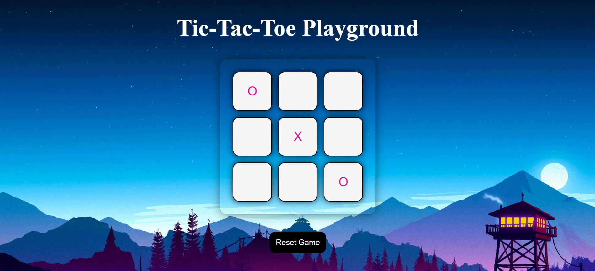

# Tic-Tac-Toe-JavaScript-Edition
  
A timeless classic, brought to life in JavaScript. Play Tic Tac Toe and see if you can get three in a row!

## Features

- **Simple to Use**
- **Aesthetic Interface**
- **Win/Lose/Tie Outcomes**
- **Play Infinite Times**

## Technologies Used

    
- **HTML**:For giving a structure to application
- **CSS**: For styling the application.
- **JavaScript**: Interactivity and Game Logic

## Live Demo
Use the project here - [Tic-Tac-Toe - created by Arsh Sandhu](https://tic-tac-toe-java-script-edition.vercel.app/)

## Preview

